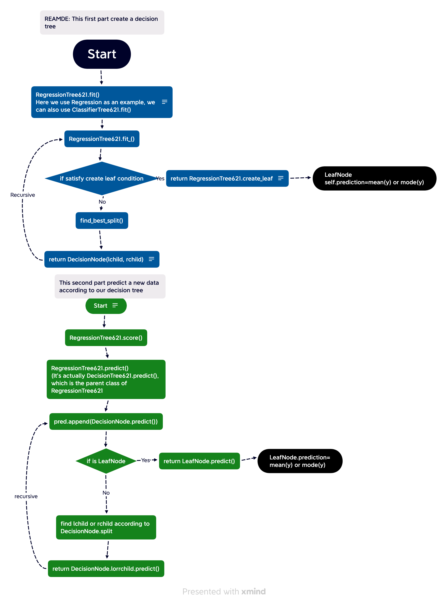

|            |                                                             |
|------------|-------------------------------------------------------------|
|Attributes|min_samples_leaf for one node, if the # of obs is less than min_samples_leaf, or the obs of same number, stop splitting.|
|          |loss for regression, we use variance, for classification, it's gini.|
|Methods|fit(X,y) fit model|
|       |predict(X) predict model|
# Regression Tree


## Example
### 1
```python
# get data
X = np.array([[1, 1], [1, 2], [2, 2], [2, 3]])
y = np.dot(X, np.array([1, 2])) + 3
# normalize(X) For Tree model, You don't need to normalize it.
# create model
model = RegressionTree621()
# fit model
model.fit(X, y)
# get predictions
y_pred = model.predict(X)

In:
y_pred
Out:
array([ 6.,  8.,  9., 11.])
In:
y
Out:
array([ 6,  8,  9, 11])
```
### 2
```python
def synthetic_data():
    """
    X:[0, 10]
    y = X + standard normal distribution, [0, 10]
    """
    n = 1000
    df = pd.DataFrame()
    df['x'] = np.linspace(0, 10, num=n)
    df['y'] = df['x'] + np.random.normal(0, 1, size=n)
    X = df['x'].values
    y = df['y'].values
    X = X.reshape(-1, 1)
    y = y.reshape(-1, 1)
    return X, y
X, y = synthetic_data()
# normalize(X) For Tree model, You don't need to normalize it.

# create model
model = RegressionTree621()
# fit model
model.fit(X, y)
# get predictions
y_pred = model.predict(X)
r2 = r2_score(y, y_pred)
r2

Out:
1.0
```


# Classification Tree
## Example

```python
X, y = load_iris(return_X_y=True)
# X, y = X[y<=1], y[y<=1] # here we can use mutiple labels
# normalize(X) For Tree model, You don't need to normalize it.

# create model
model = RegressionTree621()
# fit model
model.fit(X, y)
# get predictions
y_pred = model.predict(X)

ans = (np.sum(model.predict(X)==y))
print("correct rate: {}".format(ans/len(y)))
Out:
correct rate: 1.0
```

# Package Architecture



